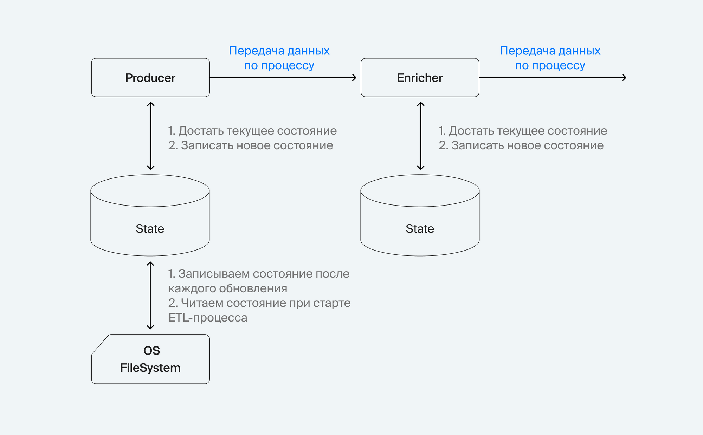

# ETL (Extract-Transform-Load) процесс

Реализованы 3 ETL процесса для заполнения индексов [movies](https://github.com/192117/admin_panel/blob/master/postgres_to_es/movies_schema.json)💾, 
[persons](https://github.com/192117/admin_panel/blob/master/postgres_to_es/persons_schema.json)💾 и [genres](https://github.com/192117/admin_panel/blob/master/postgres_to_es/genres_schema.json)💾

## Тесты для movies

[Postman-тесты](https://code.s3.yandex.net/middle-python/learning-materials/ETLTests-2.json)💾

## Особенности:

- валидация конфигурации с помощью `pydantic`;
- используется аннотации типов;
- для логирования используется модуль `logging` из стандартной библиотеки Python;
- для отказоустойчивого переноса данных из Postgres в Elasticsearch используется хранение состояния и технику backoff, 
чтобы ETL процесс не мешал восстановлению БД.

## Архитектура ETL 

_Extract должен:_
- читать данные пачками;
- спокойно переживать падение PostgreSQL;
- начинать читать с последней обработанной записи.

_Transform должен:_
- обрабатывать сырые данные из PostgreSQL и преобразовывать в формат, пригодный для записи Elasticsearch.

_Load должен:_
- загружать данные пачками;
- без потерь переживать падение Elasticsearch;
- принимать/формировать поле, которое будет считаться id в Elasticsearch.

_ETL Process должен:_
- запускать внутренние компоненты.

## Работа с состоянием

Для работы ETL нужно хранить состояние системы, чтобы при падениях не начинать загружать всё сначала. 

